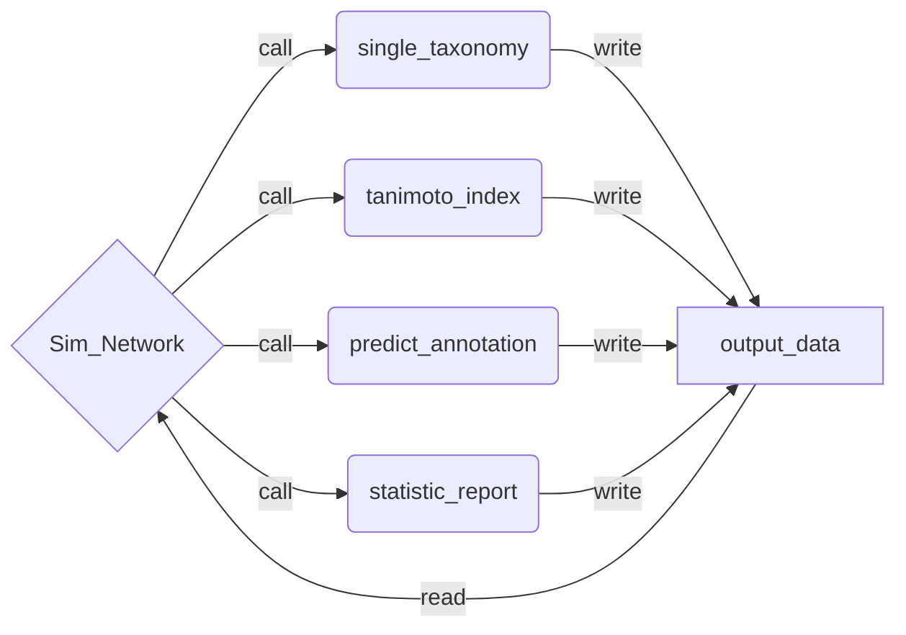

## Project Informations

This repository is the result of a Hiwi project at the Friedrich-Schiller-University Jena
in the AG Steinbeck for cheminformatics. Supervisior of this project was Dr. Maria
Sorokina. The development period was from 01.01.2021 to 01.04.2021.

### Motivation

Natural products (NP) are molecules produced by living organisms that are not part of the primary metabolism. Vitamins, antibiotics and signaling molecules are typical NPs. They are of particular importance for the discovery of new drugs, agriculture and other important applications in industry and research. The working group AG Steinbeck from Friedrich-Schiller-University Jena develops and maintains [COCONUT](https://coconut.naturalproducts.net/ ), the biggest collection of open (= freely accessible and usable) NPs. Sugar units are often present in NPsand provide for their solubility, targetting and some other bioactive properties. However, hey can be redundant and slow down the exploratory studies of the aglycons. Therefore, the [SugarRemovalUtility](https://sugar.naturalproducts.net/) (SRU), an in silico approach for molecular deglycosylation, was previously developed. 
The application of SRU to COCONUT shows that in some cases the aglycon can remain the same from one NP to another, with only the “sugar decoration” changing. In addition, it appears that a particular aglycon tends to be produced by only one particular taxonomic provenance.

The issue is that only about 20% of NPs in COCONUT have an established taxonomic provenance. 


### Aim of the project

The global goal of this project is to use aglycon information to form similarity clusters of the aglycon structure and predict the (super)kingdom for NPs of unknown taxonomic provenance.

### Acknowledgements

A big thank you to Dr. Maria Sorokina for the great help in the project and all the advice in
the process as well as the patient introduction in the field of bioinformatics. Also a big
thanks to Prof. Christoph Steinbeck for the opportunity to work on such a interesting topic
in his research group.

## Setup
Required installations of Python libraries:

```
$ conda install -c conda-forge matplotlib
$ conda install -c conda-forge python-igraph
$ conda install -c conda-forge pandas
$ conda create -c conda-forge -n my-rdkit-env rdkit
```

The installations are also possible with *pip* as installation manager.

Beside the Python libaries and the rdkit environment, MongoDB must be installed and the coconut and sweetcoconut databases must be downloaded. More information on the [MongoDB](https://www.mongodb.com/try/download/community) homepage.

## Start

Before running the program, the rdkit environment must be activated:

```
$ conda activate my-rdkit-env
```

To start to program, enter: 

```
$ python3 SimNetwork.py 
```


To adjust the similarity value for the Morgan fingerprints between aglycons, or to choose a different port,
sweetcoconut database, or coconut database, the optional inputs can be use can be used:

```
$ python3 SimNetwork.py $1 $2 $3 $4
```
- `$1`: similarity value between 0 and 1 (default: 0.95)
- `$2`: port (default: localhost:27017)
- `$3`: coconut database (default: COCONUT2020-10)
- `$4`: sweetcoconut databse (default: sweetcoconut)

> input `$4` requires also input `$3`, `$2` and `$1`, while input `$3` requires `$2` and `$1` ...


## Program structure

The program consist of 5 modules and an extra folder. Each module and also the folder should be in the same direction. The folder is needed for writing and reading files created by the program during runtime. If the folder is empty when the program starts, the programm creates all the files at runtime.
If the folder is filled with the files from the last run, all files will be **overwriten** in the new run.

<p>&nbsp;</p>
<center>

modules | folder |
---------:|:---------:|
Sim_Network.py|output_data|
single_taxonomy.py
tanimoto_index.py
predict_annotation.py
statistic_report.py

</center>
<p>&nbsp;</p>

After starting the program, the main function calls the single_taxnomy moduls and then runs through the program from top to bottom as shown in the scheme. Beside the required tables and files, there are a <span style="color:orange">bar chart</span> and a <span style="color:orange">venn diagram</span> for the aglycons and their taxonomy from the selected databases. When the program runs through the statistic_report module a json file containing a <span style="color:orange">statistic report</span> is created.


## Limits of the program

- max 3 different annotations for one aglycon:
    - normally each aglycon has only one taxonomy and sometimes two, which is possible due to the symbiosis of two different (super)kingdoms.
    So this limitation shouldn't cause any problem, if there aren't too many missanotations in the selected database.    

- the only allowed superkingdoms in the database with the notation are:
    - animals
    - plants
    - bacteria
    - fungi
    - marine


## Future of the project
This repository will not be improved or updated. All adaptations of the 
project will be managed by my supervisor Dr. Maria Sorokina.
Contacts and information are available through the [Cheminformatics and Computational Metablomics
platform](https://cheminf.uni-jena.de), or directly from 
[Maria Sorokina](https://cheminf.uni-jena.de/members/maria-sorokina/).

### Possible extensions or improvements
- the program is basesd a one simple comparison of structures, which leads to a long runtime
(O(n<sup>2</sup>)). A time-efficient search algorithm for two-pair comparisons could therefore reduce the runtime immensley.
- the number of usable superkingdoms could be extended
- So far there is no validation of the predictions made for the superkingdoms


