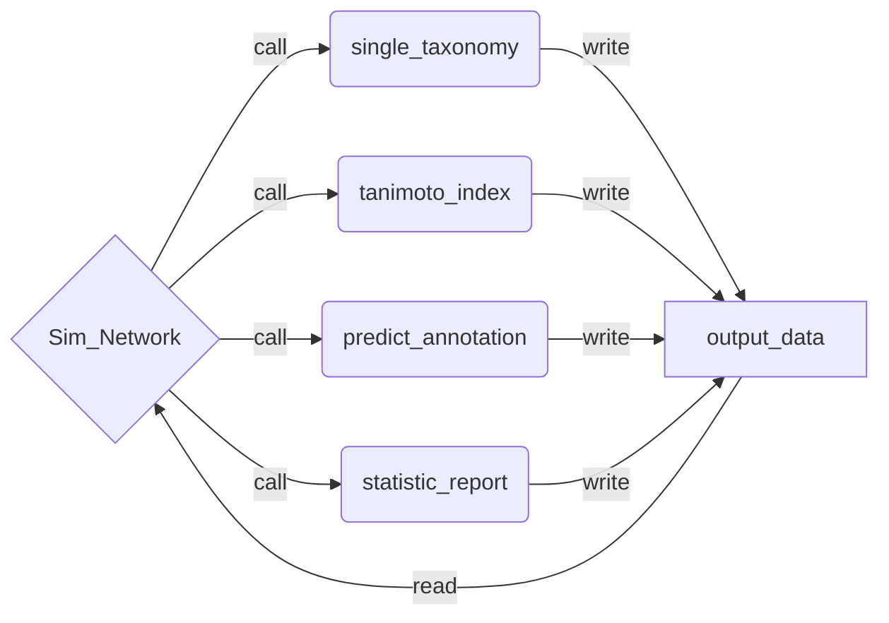

# README


## Project Informations

This repository is the result of a Hiwi project at the Friedrich-Schiller-University Jena
in the AG Steinbeck for cheminformatics. Supervisior of this project was Dr. Maria
Sorokina. The development period was from 01.01.2021 to 01.04.2021.

### Motivation

Natural products (NP) are molecules produced by living organisms that are not part of the primary metabolism. Vitamins, antibiotics and signaling molecules are typical NPs. They are of particular importance for the discovery of new drugs, agriculture and other important applications in industry and research. The working group AG Steinbeck from Friedrich-Schiller-University Jena develops and maintains [COCONUT](https://coconut.naturalproducts.net/ ), the biggest collection of open (= freely accessible and usable) NPs. Sugar units are often present in NPsand provide for their solubility, targetting and some other bioactive properties. However, hey can be redundant and slow down the exploratory studies of the aglycons. Therefore, the [SugarRemovalUtility](https://sugar.naturalproducts.net/) (SRU), an in silico approach for molecular deglycosylation, was previously developed. 
The application of SRU to COCONUT shows that in some cases the aglycon can remain the same from one NP to another, with only the “sugar decoration” changing. In addition, it appears that a particular aglycon tends to be produced by only one particular taxonomic provenance.

The issue is that only about 20% of NPs in COCONUT have an established taxonomic provenance. 


### Aim of the project

The global goal of this project is to use aglycon information to form similarity clusters of the aglycon structure and predict the (super)kingdom for NPs of unknown taxonomic provenance.

### Acknowledgements

A big thank you to Dr. Maria Sorokina for the great help in the project and all the advice in
the process as well as the patient introduction in the field of bioinformatics. Also a big
thanks to Prof. Christoph Steinbeck for the opportunity to work on such a interesting topic
in his research group.

## Setup
Required installations of Python libraries:

```
$ conda install -c conda-forge matplotlib
$ conda install -c conda-forge python-igraph
$ conda install -c conda-forge pandas
$ conda create -c conda-forge -n my-rdkit-env rdkit
```

The installations are also possible with *pip* as installation manager.

Beside the Python libaries and the rdkit environment you have to install [MongoDB](https://www.mongodb.com/try/download/community) and download the coconut and sweetcoconut databases. More information on the MongoDB Homepage.

## Start

Before running the program, the rdkit environment must be activated

```
$ conda activate my-rdkit-env
```
In this project there were two different databases used. Both of them are open source
MongoDB databases.
One is called COCONUT (used version and also default: COCONUT2020-10, but there is 
recently a new one released). The smaler one is called sweetcocnut.
The databases provide the structures as smiles code and the and also the taxonomy of the 
aglycon.

To start to program type in:

```
$ python3 SimNetwork.py 
```


For customizing the similarity value between the aglycons, or choose another port
sweetcoconut database or coconut database you can use the optional inputs:

```
$ python3 SimNetwork.py $1 $2 $3 $4
```
- `$1`: similarity value between 0 and 1 (default: 0.95)
- `$2`: port (default: localhost:27017)
- `$3`: coconut database (default: COCONUT2020-10)
- `$4`: sweetcoconut databse (default: sweetcoconut)

> input `$4` requires also input `$3`, `$2` and `$1`, while input `$3` requires `$2` and `$1` ...


## Program structure

The program consist of 5 modules and one folder. Every modul and also the folder should be in the same direction. The folder is required for writing and reading of files, which are created by the programm while running the script. If the folder is empty at the starting point of the programm, the programm will create all files and plots by runtime.
If the folder is filled with the files from the last run, all files will be **overwriten** in the new run.

<p>&nbsp;</p>
<center>

modules | folder |
---------:|:---------:|
Sim_Network.py|output_data|
single_taxonomy.py
tanimoto_index.py
predict_annotation.py
statistic_report.py

</center>
<p>&nbsp;</p>

After running the program, the main function will call the single_taxnomy modul and then runs through the program from top to the bottom as shown in the scheme. Beside the required tables and files, there are a <span style="color:orange">bar plot</span> and a <span style="color:orange">venn diagram</span> for the aglycons and their taxonomy from the choosen databases and after the prediction of the taxonomy there is a <span style="color:orange">json file statistic report</span> created in the statistic report modul.


## Limits of the program

- max 3 different annotations are possible:
    - every aglycon with max 3 different annotations can be handled by the programm,
    if any aglycon has more than 3 different annotations the programm will be killed, 
    because instead of a list of a taxonomy, this will lead to a list of list of aglycons
    which cannot be compared to the other entries

- the only allowed superkingdoms in the same spelling are:
    - animals
    - plants
    - bacteria
    - fungi
    - marine


## Future of the project
This project will not be improved in the future from my side. All adaptations of the 
project will be managed by my supervisor Dr. Maria Sorokina.
Contacts and informations are available at the [Cheminformatics and Computational Metablomics
platform](https://cheminf.uni-jena.de), or directly by 
[Maria Sorokina](https://cheminf.uni-jena.de/members/maria-sorokina/).

### Possible extensions or improvements
- the program bases one simple comparing of structures, which leads to a long runtime
O(n<sup>2</sup>). So a time efficient search algorithm could decrease the time immensley.
- the number of superkingdoms could be extended
- Up to now there is no validation on the predictions done


